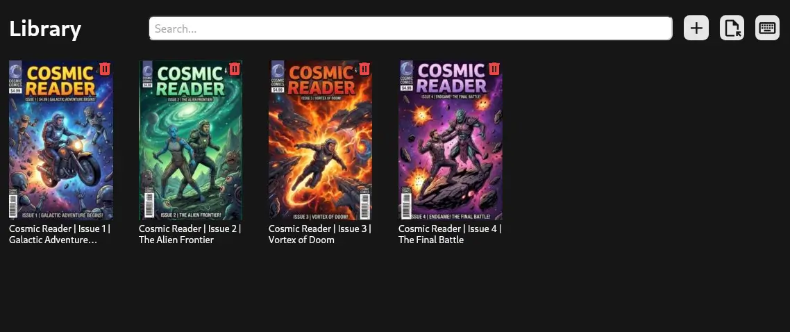

# Cosmic Reader

A cross-platform desktop app for reading and managing comics, built with [Wails](https://wails.io/). Supports CBZ, CBR, CB7, and CBT archive formats.



## Getting Started

Clone the repository

```bash
git clone https://github.com/syeero7/cosmic-reader
cd cosmic-reader
```

Install wails and required dependencies. [Wails docs](https://wails.io/docs/gettingstarted/installation)
\*this project built using wails v2.11.0

Build the compiled binary

```bash
# linux
wails build -upx -trimpath -platform=linux
 
# windows
wails build -upx -trimpath -platform=windows
```
